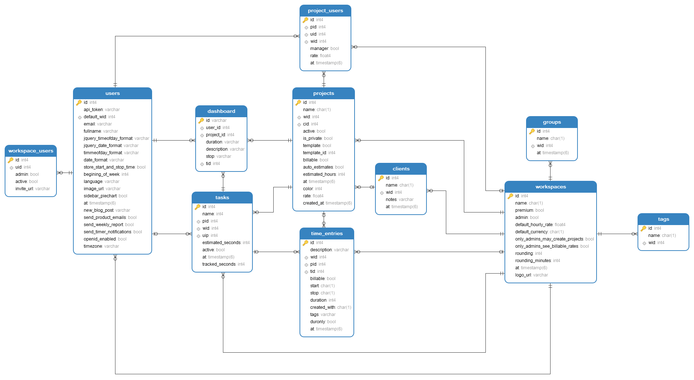

# Wakt


----
[](https://github.com/AhmedShaef/wakt)
[](https://github.com/AhmedShaef/wakt/wiki)


# Getting Started
Wakt is an open-source time tracking Microservice, based on [Ardanlabs service 3](https://github.com/ardanlabs/service) and inspired by [Toggl track](https://toggl.com/track/).
### Prerequisites

* [Go 1.18 +](https://golang.org/doc/install)
* [docker](https://www.docker.com/community-edition)
* [kind](https://kind.sigs.k8s.io/docs/user/quick-start/)
* [kubectl](https://kubernetes.io/docs/tasks/tools/)
* [kustomize](https://kubectl.docs.kubernetes.io/installation/kustomize/)

You can run this make command to use brew to install all the software above.
```shell
make dev.setup.mac
```
## To start using wakt
```shell
    make all
    make kind-up
    make kind-load
    make kind-apply
```    
Check status
```shell
    make kind-status 
```
Check logs
```shell
    make kind-logs
```
## To stop using wakt
```shell
    make kind-down
```
## Run tests
```shell
    make test
```
----
## Data Model

----
## TODO for v1.0.0
### in API :
1. [ ] Decrase number of db cooniction per request
2. [ ] Improve notufcation system
3. [ ] Report package
4. [ ] invoce and payment
5. [ ] Oauth2
6. [ ] improve comments
7. [ ] missing funcalities

### in UI:
* Design UI/UX and Code (using React.js) the following:
  1. [ ] App Dashboard
  2. [ ] Home Page
  3. [ ] Price Page
  4. [ ] SignUp/Login/forget password Pages
  5. [ ] Email HTML Template for:
     1. [ ] SignUp validation
     2. [ ] Invitations
     3. [ ] Reset email/password
     4. [ ] Reports and invoices
